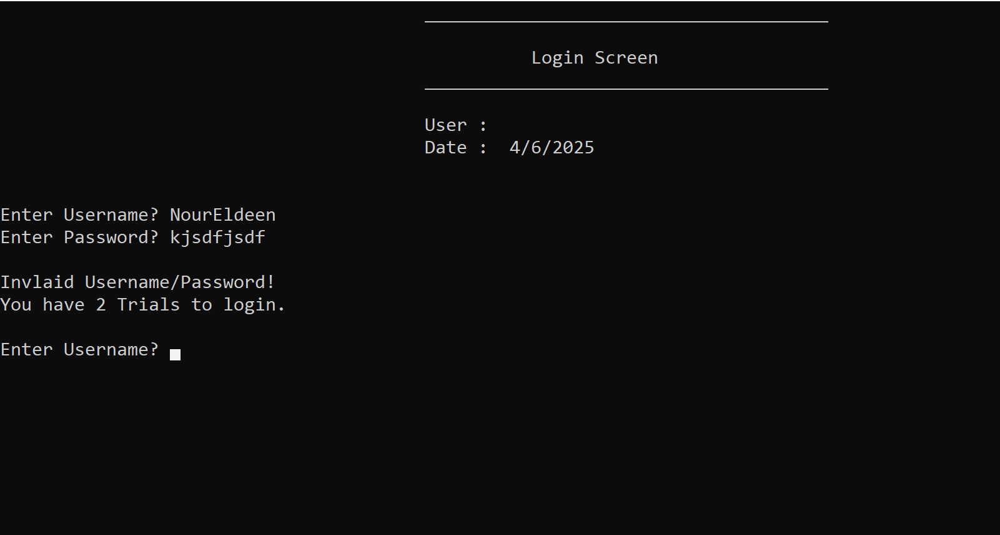
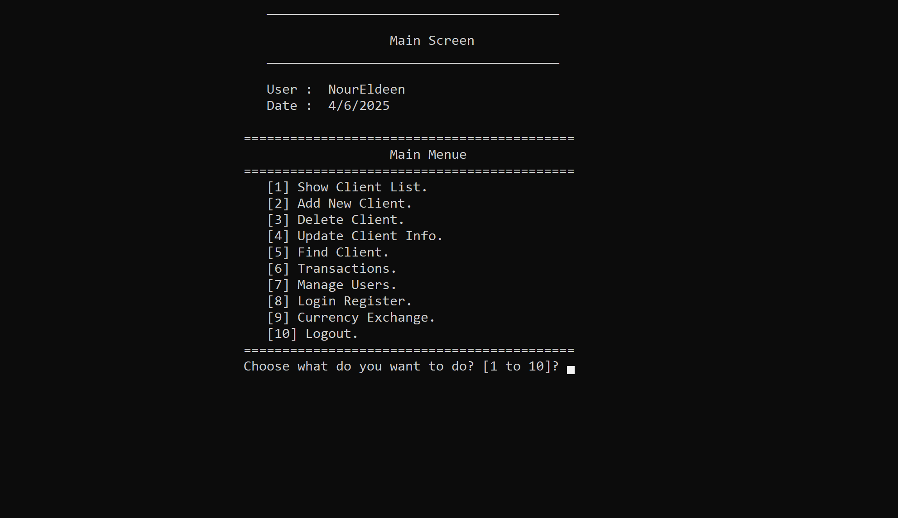
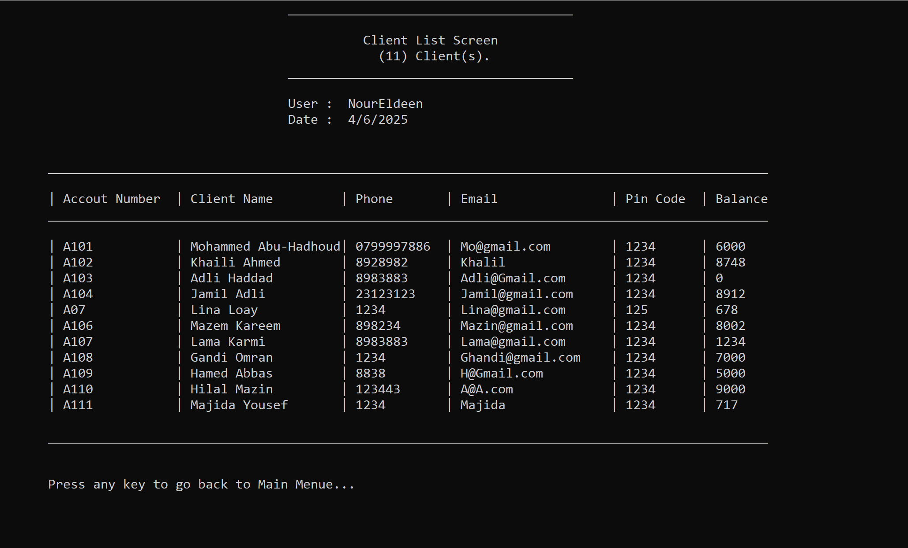
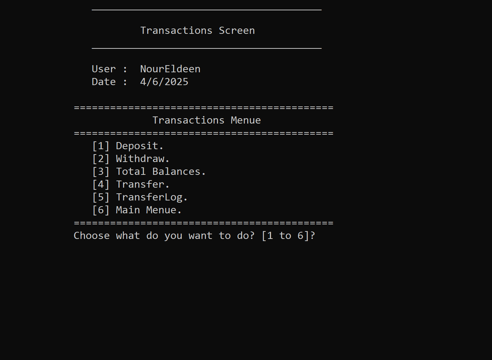
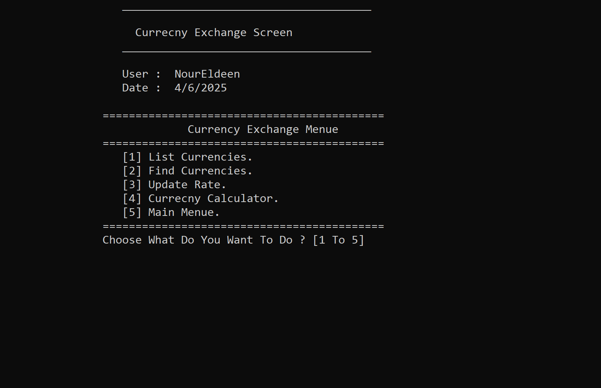
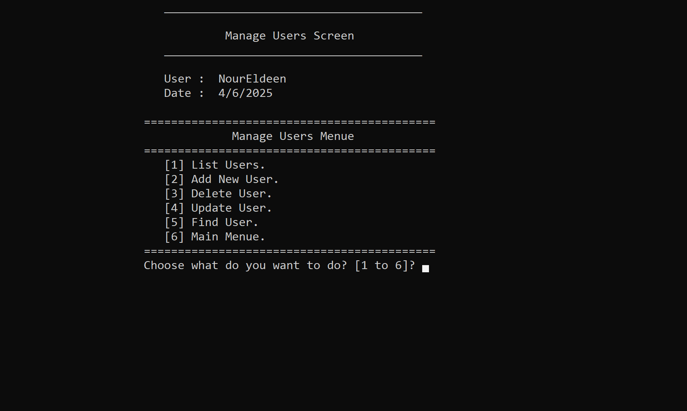

# 🏦 Bank System


## 📋 Overview
A comprehensive Bank Management System built using C++ and Object-Oriented Programming principles. This system provides an interactive command-line interface that allows users to manage client accounts, financial transactions, currency exchange, and user administration with permission controls.


## ✨ Key Features
### 👥 Login


### 👥 Client Management
- 📊 View list of clients
- ➕ Add new client
- ❌ Delete client
- 🔄 Update client information
- 🔍 Find client




### 💰 Financial Transactions
- 💵 Deposit funds
- 💸 Withdraw funds
- ↔️ Transfer funds between accounts
- 📈 View total balances
- 📝 Transfer logs



### 💱 Currency Exchange
- 🧮 Currency conversion calculator
- 📊 Update currency exchange rates
- 🔍 Find currency
- 📋 List of available currencies



### 👤 User Management
- 🔐 Login and logout functionality
- 📒 Login register
- ➕ Add new user
- 🔄 Update user information
- ❌ Delete user
- 📋 List users
- 🔒 Multi-level permission system



## 🛠️ Technologies Used
- 💻 Programming Language: C++
- 🧩 Object-Oriented Programming (OOP)
- 📁 File handling for storage
- 🖥️ Command-Line Interface (CLI)
- 🔄 Inheritance, Polymorphism, and Encapsulation
- ✅ Input validation


## 📊 Project Structure

```
bank-system/
├── src/
│   ├── main.cpp
│   ├── clients/
│   ├── transactions/
│   ├── currency/
│   └── users/
├── include/
│   ├── models/
│   └── screens/
└── data/
    ├── clients.txt
    ├── users.txt
    ├── currencies.txt
    └── logs.txt
```

## 🚀 Getting Started

1. Clone the repository
2. Compile the project using C++ compiler
3. Run the executable file
4. Login with default credentials (admin/admin)
